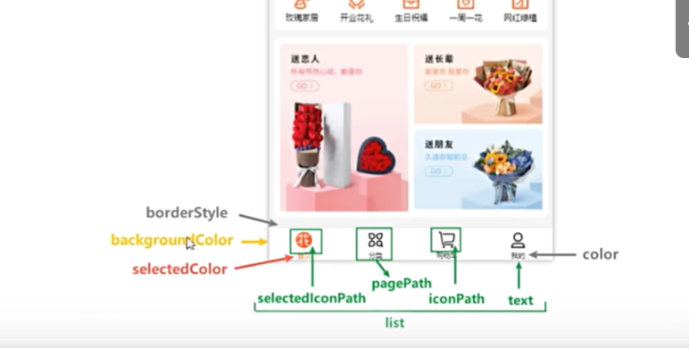

[TOC]

## 准备

1. 开发者ID：小程序ID和小程序密钥
2. 新建小程序项目、开发、真机调试等需要
3. 下载微信开发者工具、需联网使用

## 文件和目录结构

1. 主体文件 + 页面文件

2. 主体文件：又称全局文件，能够作用于整个小程序，影响到小程序的每个页面，主体文件必须放在项目根目录

   + app.js：小程序入口文件

   + app.json：小程序的全局配置文件

   + app.wxss：全局样式文件

     *主体文件必须以app开头*

3. 页面文件：是每个页面所需的文件，小程序页面文件放在pages目录下，一个页面一个目录

   + .js：页面逻辑

   + .wxml：页面结构

   + .wxss：页面样式

   + .json：小页面配置

     *js文件和wxml文件是必须的*

4. 小程序有两种渲染模式：skyline和WebView，skyline较新，切换成webview需在app.json删掉以下部分，ctrl+s保存即可

   ``````json
     "renderer": "skyline",
     "rendererOptions": {
       "skyline": {
         "defaultDisplayBlock": true,
         "disableABTest": true,
         "sdkVersionBegin": "3.0.0",
         "sdkVersionEnd": "15.255.255"
       }
     },
     "componentFramework": "glass-easel",
   ``````

5. `components`文件存放公共组件

6. 根目录其他json文件为配置文件

7. 如何新建页面：

   + 方法1：pages下新建文件夹，右键新建好的文件夹，输入页面名称即可自动创建，无需写后缀
   + 方法2：在app.json的pages中写入后保存即可自动添加

8. 调试基础库：微信开发者工具中可以选择的微信基础库版本

   + 微信基础库是指小程序的运行环境，给小程序提供了运行所需的各种API和工具以及基础框架和运行逻辑等

   + 小程序开发者可以在微信开发者工具中选择所需的微信基础库版本，作为运行和调试小程序时的运行环境。
   + 每个小程序有自己所允许使用的基础库最低版本要求，开发者需要选择要兼容的基础库版本，从而确保小程序的功能正常运行。
   + 请前往工具栏-详情-本地设置更改基础库版本。

9. [微信小程序开发文档](https://developers.weixin.qq.com/miniprogram/dev/framework/)

## 调试小程序

1.  点击调试器，下方出现调试器面板
   + wxml：样式
   + console：控制台，打印信息，想隐藏系统打印信息可右键选择`hide message。。。`
   + network：调试网络请求
   + AppData：数据
   + Storage：本地存储数据
2. 编译、预览（生成二维码，手机扫码，手机右上角三个点可选择`开发调试`）、真机调试（调试器）、清缓存（如果还有错误，则需要点击左上角`项目`->`重新打开此项目`

## 配置文件介绍

1. JSON是一种轻量级的数据格式，常用于前后端数据的交互，但是在小程序中，JSON扮演的配置项的角色，用于配置项目或者页面属性和行为，每个页面或组件也都有一个对应的json文件。
2. app.json:小程序全局配置文件，用于配置小程序的一些全局属性和页面路由。
3. 页面.json:小程序页面配置文件，也称局部配置文件，用于配置当前页面的窗口样式、页面标题等
4. project.config.json:小程序项目的配置文件，用于保存项目的一些配置信息和开发者的个人设置
5. sitemap.json：配置小程序及其页面是否允许被微信索引，提高小程序在搜索引擎搜索到的概率

## 全局配置

1. pages字段：用来指定小程序由哪些页面组成，用于让小程序知道由哪些页面组成以及页面定义在哪个目录，每一项都对应一个页面的路径信息。

   未指定entryPagePath时，数组的第一项代表小程序的初始页面（首页）

2. window字段：用于设置小程序的状态栏、导航条、标题、窗口背景色。（参考官方文档）

3. tabBar字段：定义小程序顶部、底部tab栏，用以实现页面之间的快速切换。可以通过tabBar配置项指定tab栏的表现，以及tab切换时显示的对应页面。

   tab按数组的顺序排序，list配置最少2个、最多5个tab

## 页面配置（局部配置）

1. 小程序的页面配置，也称局部配置，每一个小程序页面也可以使用自己的json文件来对本页面的窗口表现进行配置

   需要注意的是：页面配置文件的属性和全局配置文件中的window属性几乎一致，只不过这里不需要额外指定window字段，因此如
   果出现相同的配置项，页面中配置项会**覆盖全局配置文件中相同的配置项**。

## 项目配置文件和配置sass

1. 在创建项目的时候，每个项目的根目录生成两个config.json文件，用于保存开发者在工具上做的个性化配置，例如和编译有关的配置。

2. 当重新安装微信开发者工具或换电脑工作时，只要载入同一个项目的代码包，开发者工具就会自动恢复到当时开发项目时的个性化配置。

3. 项目根目录中的project.config.json和project.private.config.json文件都可以对项目进行配置

   > project.config.json:项目配置文件，常用来进行配置公共的配置
   > project.private.config.json:项目私有的配置，常用来配置个人的配置，应写到.gitignore避免版本管理冲突
   >
   > **与编译结果有关的设置必须设置到project.config.json**

4. 配置sass：

   > 在project.config.json的setting属性加入
   >
   > ``````json
   > "useCompilerPlugins":[
   >       "sass"
   >     ]
   > ``````
   >
   > 将页面中的wxss文件改成scss

## sitemap.json配置

1. sitemap.json文件：配置小程序及其页面是否允许被微信索引，提高小程序在微信内部被用户搜索到的概率

2. 微信现已开放小程序内搜索，开发者可以通过sitemap.json配置来设置小程序页面是否允许微信索引。当开发者允许微信索引时，微信会通过爬虫的形式，为小程序的页面内容建立索引。当用户的搜索词条触发该索引时，小程序的页面将可能展示在搜索结果中

   > 1.注：没有sitemap.json则默认所有页面都能被索引
   > 2.("action":"allow”,"page":"*''}是优先级最低的默认规则，未显式指明"disallow"的都默认被索引